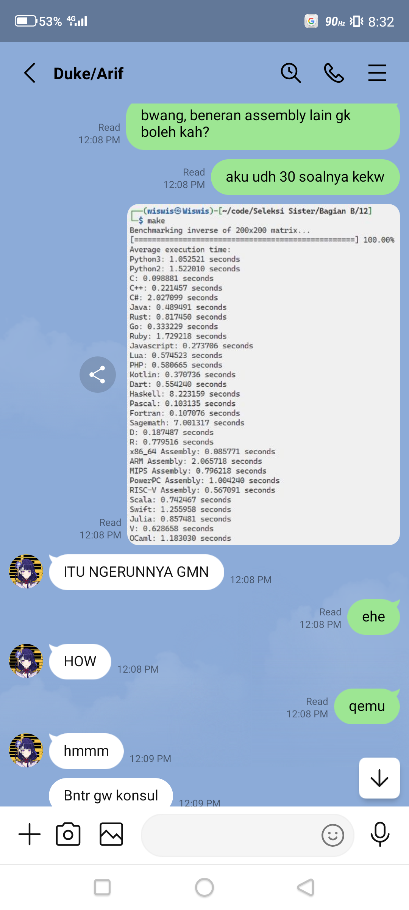
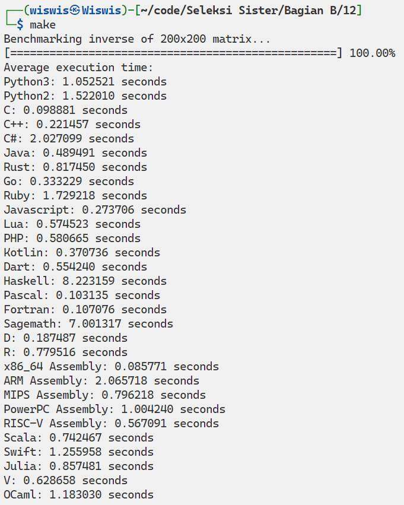

# Bahasa pemrograman yang di implementasikan ada:

1. ARM Assembly
2. C
3. C++
4. C#
5. D
6. Dart
7. Fortran
8. Go
9. Haskell
10. Java
11. Javascript
12. Julia
13. Kotlin
14. Lua
15. MIPS Assembly
16. OCaml
17. Pascal
18. PHP
19. PowerPC Assembly
20. Python2
21. Python3
22. R
23. RiscV64 Assembly
24. Ruby
25. Rust
26. Sagemath
27. Scala
28. Swift
29. V
30. x86_64 Assembly

> Yes i know ada 5 assembly, tapi kata duke boleh

> Hasil Benchmarking
